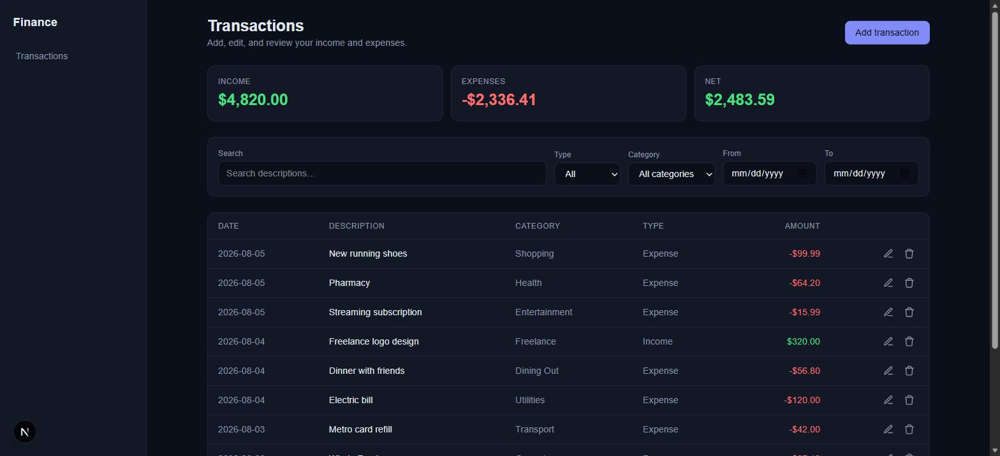
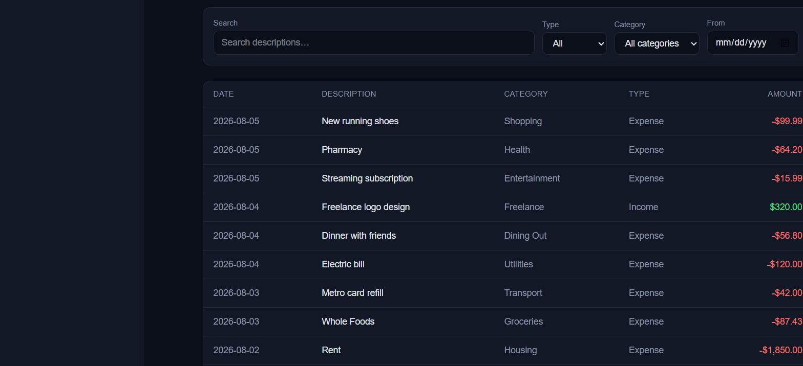
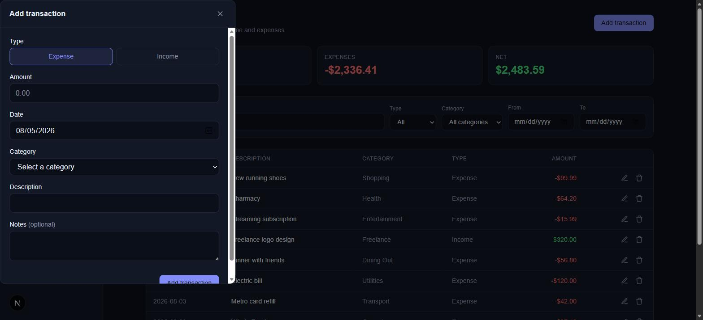
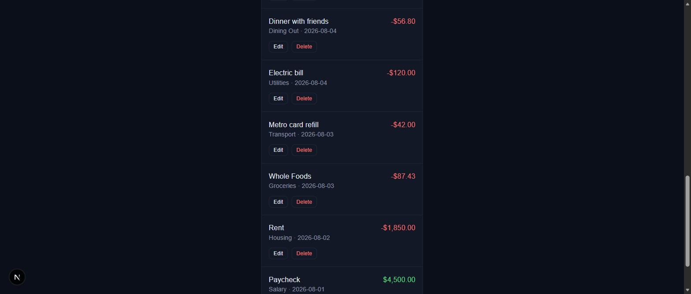
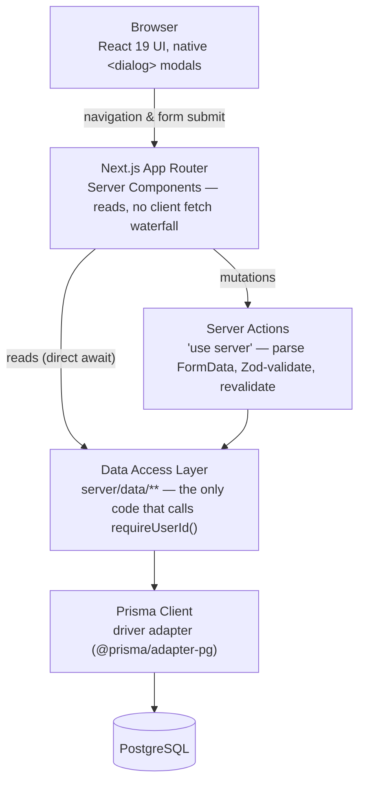

# Personal Finance Dashboard

A privacy-first, manual-entry personal finance tracker. Log income and expenses, categorize them, and see your monthly totals update immediately — no bank connections, no stored banking credentials, ever.

[](https://nextjs.org/)
[](https://www.typescriptlang.org/)
[](https://www.prisma.io/)
[](https://www.postgresql.org/)
[](https://vitest.dev/)
[](https://github.com/yvandor/personal-finance-dashboard/actions/workflows/ci.yml)

---

## Hero

<p align="center">
  
</p>

## Why this exists

Bank statements are transaction-level and category-free. DIY spreadsheets rot. Aggregators that scrape your bank require handing over credentials, which a meaningful share of privacy-conscious people will simply refuse. This project's position: **manual entry is the product, not a limitation** — the tradeoff we accept is that you type in your own transactions; the tradeoff we're building to win is that entry is fast and the resulting picture is immediate. See [`docs/PROJECT_PLAN.md`](../docs/PROJECT_PLAN.md) (one level up, at the repo's outer root) for the full product and architecture plan this build follows.

## Features

Currently implemented (Phases 1–3 of the project plan):

- **Transaction CRUD** — add, edit, and delete income/expense transactions with server-validated amount, date, category, description, and optional notes
- **Live summary cards** — income, expenses, and net totals for whatever the current filter/search shows
- **Search and filter** — text search on description, plus type/category/date-range filters, all combining and persisted in the URL
- **Keyset-paginated transaction list** — a real desktop table and a separate mobile card list, both server-rendered from the same query
- **Accessible, resilient forms** — labels tied to inputs, validation errors wired via `aria-describedby`/`aria-invalid`, and a failed submission never discards what you typed
- **Per-user data isolation by construction** — every query is scoped through a single `requireUserId()` seam; no code path anywhere accepts a `userId` from the client

Not yet built — see [Roadmap](#roadmap) below: budgets, savings goals, dashboard charts, authentication.

## Screenshots

| Transactions overview (desktop) | Transaction list |
|---|---|
|  |  |

| Add transaction dialog | Mobile layout |
|---|---|
|  |  |

*There is currently one route (`/transactions`) that serves as both the overview and the ledger — a dedicated `/dashboard` with charts is planned (see [Roadmap](#roadmap)). The mobile screenshot was captured with the real mobile-card markup rendered under a forced narrow viewport, because the sandboxed environment this was captured in could not shrink the actual browser window below ~1528px; the desktop screenshots reflect a genuine 1440px window.*

## Architecture overview

One direction of dependency, enforced by convention today (see [Roadmap](#roadmap) for making it a lint rule): Server Components read; Server Actions write; only the data-access layer touches Prisma.



**Reads** skip the Server Action layer entirely — a Server Component calls the DAL directly (`await listTransactions(...)`), since there's no client-side fetch to coordinate. **Writes** always go through a Server Action, which parses `FormData`, validates it with the same Zod schema the DAL itself re-checks, and returns an `ActionResult<T>` (`{ ok, data }` or `{ ok: false, error, fieldErrors }`) rather than throwing — consumed client-side via `useActionState`. The DAL (`server/data/**`) is the only place `PrismaClient` is imported, and every exported function opens by calling `requireUserId()` (`server/context.ts`) — there is no function signature anywhere that accepts a `userId` parameter, so there's nothing for a caller to spoof.

### Layers

```
app/**              Routes. Server Components render; awaits the DAL directly for reads.
server/actions/**    'use server' — thin: FormData → Zod → DAL call → revalidatePath → ActionResult.
server/data/**       'server-only' DAL. The only place `prisma` is imported. Opens with requireUserId().
server/db.ts         PrismaClient singleton (driver-adapter based — Prisma 7 ships no bundled engine binary).
lib/**               Dependency-free: money math (lib/money.ts), Zod schemas (lib/schemas/*), ActionResult type.
```

## Tech stack

| Layer | Choice | Why |
|---|---|---|
| Framework | [Next.js 16](https://nextjs.org/) (App Router, Turbopack) | Server Components for reads, Server Actions for writes, no separate REST API needed for a single-consumer app |
| Language | TypeScript (strict) | End-to-end type safety from the Zod schema through the DAL to the rendered props |
| UI runtime | React 19.2 | `useActionState` for form/mutation state, native `<dialog>` for accessible modals |
| Styling | Tailwind CSS 4 (CSS-first `@theme`) | No separate config file; design tokens live in `app/globals.css` |
| ORM | [Prisma 7](https://www.prisma.io/) with `@prisma/adapter-pg` | Type-safe queries; the driver-adapter model means no bundled native engine binary |
| Database | PostgreSQL 17 | `pg_trgm` trigram index powers substring description search |
| Validation | [Zod](https://zod.dev/) `.strict()` schemas | Shared between client hints and server enforcement; `.strict()` rejects unknown keys outright — the mass-assignment guard |
| Testing | [Vitest](https://vitest.dev/) | Unit tests for pure logic, integration tests against a real Postgres database (no Prisma mocking) |
| CI | GitHub Actions | Postgres service container; runs typecheck, lint, migrate, test, build on every push/PR |

## Folder structure

```
web/
├── app/
│   ├── (dashboard)/
│   │   ├── layout.tsx            # sidebar (desktop) / top bar (mobile) shell
│   │   └── transactions/
│   │       ├── page.tsx          # Server Component: reads searchParams, calls the DAL
│   │       ├── loading.tsx
│   │       └── error.tsx
│   ├── layout.tsx                # root shell
│   ├── globals.css               # Tailwind v4 @theme tokens
│   └── page.tsx                  # redirects "/" -> "/transactions"
├── server/
│   ├── db.ts                     # PrismaClient singleton (driver adapter)
│   ├── context.ts                # requireUserId() — the sole auth seam
│   ├── data/                     # DAL — only place `prisma` is imported
│   │   ├── transactions.ts
│   │   └── categories.ts
│   └── actions/
│       └── transactions.ts       # 'use server' mutations
├── lib/
│   ├── money.ts                  # parseMoneyToCents / formatCents — the only arithmetic site
│   ├── result.ts                 # ActionResult<T>
│   ├── errors.ts                 # NotFoundError / ValidationError
│   └── schemas/
│       └── transaction.ts        # Zod: create/update/filter schemas
├── components/
│   ├── ui/                       # Button, Modal, ConfirmDialog, Money
│   └── transactions/              # form, dialog, table row, card, filters, pager, summary cards
├── prisma/
│   ├── schema.prisma
│   ├── migrations/
│   └── seed.ts                   # dev user + default categories
├── tests/
│   ├── unit/                     # pure logic — money, Zod schemas
│   └── integration/               # real Postgres — CRUD + cross-user isolation
└── .github/workflows/ci.yml
```

`prisma/schema.prisma` already defines `Budget`, `SavingsGoal`, and `SavingsContribution` models (see [Roadmap](#roadmap)) — the schema was designed up front for the full product, even though only `Category`/`Transaction` have a DAL, Server Actions, and UI so far.

## Installation

Prerequisites: **Node 24+**, a local **PostgreSQL 13+** instance (`pg_trgm` extension required — the migration installs it automatically).

```bash
git clone https://github.com/yvandor/personal-finance-dashboard.git
cd personal-finance-dashboard/web
npm install
```

## Database setup

1. Copy the env templates and fill in your local Postgres connection details:
   ```bash
   cp .env.example .env
   cp .env.test.example .env.test   # must point at a SEPARATE database — tests truncate freely
   ```
2. Apply the schema:
   ```bash
   npx prisma migrate deploy
   ```
3. Seed the fixed dev user and default categories:
   ```bash
   npm run db:seed
   ```

There is no authentication yet (see [Roadmap](#roadmap)). Every request acts as one fixed user, resolved from the `DEV_USER_ID` environment variable through a single seam (`server/context.ts`) — see that file's comments for how this is designed to be a drop-in swap for real session-based auth later, without touching any query in the app.

## Local development

```bash
npm run dev
```

Visit `http://localhost:3000` — it redirects to `/transactions`, currently the app's only real page.

## Running tests

```bash
npm run test
```

```
tests/
  unit/         Pure logic — Zod schema validation, money parsing/formatting. No database.
  integration/  Real CRUD against a real Postgres database (tests/integration, using .env.test).
                No mocking of Prisma — including the cross-user data-isolation suite.
```

`vitest.config.mts` loads `.env.test` and sets the `react-server` module-resolution condition that `server-only`-guarded files need outside of Next's own bundler. Integration tests wipe and reseed a fixed dev user and a second test user before each test (`tests/setup.ts`) — point `.env.test` at a database that's safe to truncate.

## CI workflow

[`.github/workflows/ci.yml`](.github/workflows/ci.yml) runs on every push and pull request against a throwaway **Postgres 17 service container**, in this order:

| Step | Command |
|---|---|
| Install | `npm ci` |
| Generate Prisma client | `npx prisma generate` |
| Type check | `npx tsc --noEmit` |
| Lint | `npx eslint .` |
| Apply migrations | `npx prisma migrate deploy` |
| Test (unit + integration) | `npm run test` |
| Production build | `npm run build` |

Every one of those can be run locally in the same order — see the table above. The only thing CI doesn't cover is a manual smoke test against the long-lived local dev database, which is a deliberate call: the integration suite already exercises the same code paths against a real database on every run.

## Accessibility

- Every form control has a real `<label htmlFor>` tied to its input's `id` — ids are generated per-instance with React's `useId()` so multiple simultaneously-mounted forms (one edit dialog per row, in both the desktop table and mobile card list) never collide
- Validation errors are wired to their field via `aria-describedby` and `aria-invalid`, and rendered with `role="alert"`
- Modals use the native `<dialog>` element with `showModal()`, which gives focus trapping and `Escape`-to-close for free; verified live that focus lands inside the dialog on open
- A failed form submission never discards what you typed — every field is a controlled input that survives a validation round trip, across all six transaction fields (type, amount, date, category, description, notes)
- Icon-only buttons (edit/delete row actions) carry explicit `aria-label`s

## Security

- **No `userId` ever accepted from the client.** The sole source of the acting user is `requireUserId()` (`server/context.ts`) — no Server Action, DAL function, or Zod schema has a `userId` parameter or field for a caller to spoof.
- **Ownership is part of the write query itself**, not a separate check-then-write step: mutations use `updateMany`/`deleteMany` with `{ id, userId }` in the `where` clause, so there's no race between an ownership check and the write.
- **`.strict()` Zod schemas** on every mutation reject unknown keys outright — the mass-assignment guard — rather than silently stripping them.
- **Server-side validation is the only enforcement point that counts**; any client-side validation is UX only, and every Server Action re-parses input from scratch.
- **Money is integer cents end to end** — no floats in storage, computation, or over-the-wire payloads — eliminating an entire class of rounding/precision bugs in a domain where they're unacceptable.
- **No secrets committed** — `.env*` is git-ignored except the `*.example` templates, which list variable names only.
- Full threat model, session-strategy recommendations, and the pre-auth deployment gate (**this app must never be deployed to a public host before authentication lands**) are documented in [`docs/PROJECT_PLAN.md`](../docs/PROJECT_PLAN.md) §8.

## Roadmap

Near-term, in the order the project plan sequences them:

- [ ] **Categories UI** — create/rename/archive, with the documented reassign-or-block delete policy
- [ ] **Budgets** — per-category monthly targets and actual-vs-budget progress (schema already exists)
- [ ] **Savings goals** — target/progress tracking via a contribution ledger (schema already exists)
- [ ] **Dashboard charts** — spending-by-category and monthly cash-flow trend, as their own `/dashboard` route
- [ ] **Authentication (Auth.js)** — deliberately sequenced after the core UI; the schema and `requireUserId()` seam were designed for this from the first migration, so this becomes a swap of one function's body plus route protection, not a data-model rewrite
- [ ] Enforce the DAL/Prisma import boundary with an ESLint `no-restricted-imports` rule (currently a convention, not yet a build-time check)

## Future features

Deliberately out of MVP scope, tracked in the project plan as post-MVP candidates: recurring transactions, CSV export/import, budget-threshold notifications, multi-currency, and shared/household accounts. Explicitly and permanently out of scope: bank/aggregator connections and storing banking credentials of any kind — this is a hard product constraint, not a sequencing decision.

## Contributing

This is currently a solo learning/portfolio project built in explicit, reviewed phases (see `docs/PROJECT_PLAN.md` §10 for the phase breakdown). Issues and suggestions are welcome. If you'd like to contribute code:

1. Open an issue describing the change before sending a large PR — this project follows an explicit plan-then-build process, and unplanned scope (see the plan's "explicitly out of scope" table) will likely be declined.
2. Run the full local check suite before opening a PR: `npx tsc --noEmit && npx eslint . && npm run test && npm run build`.
3. Keep the architecture invariants intact: no `prisma` import outside `server/data/**`, no `userId` accepted as a parameter anywhere, server-side Zod validation on every mutation.

## License

No license file is currently included in this repository, which means all rights are reserved by default — the code is not licensed for reuse. Open an issue if you'd like to discuss adding an explicit open-source license.
