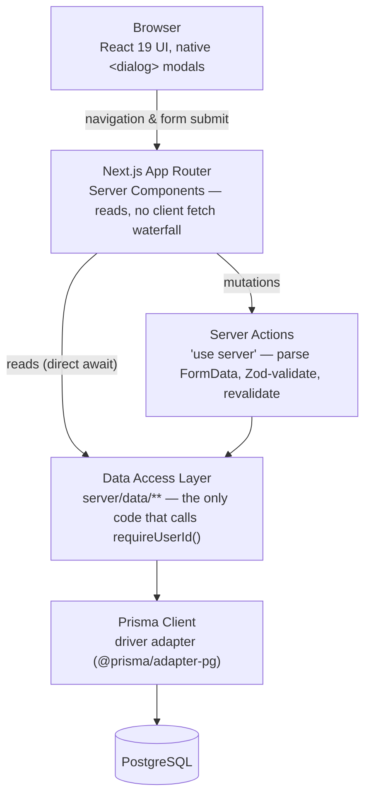

# Personal Finance Dashboard

A privacy-first, manual-entry personal finance tracker. Log income and expenses, categorize them, and see your monthly totals update immediately — no bank connections, no stored banking credentials, ever.

[](https://nextjs.org/)
[](https://www.typescriptlang.org/)
[](https://www.prisma.io/)
[](https://www.postgresql.org/)
[](https://vitest.dev/)
[](https://github.com/yvandor/personal-finance-dashboard/actions/workflows/ci.yml)

---

## Hero

<p align="center">
  
</p>

## Why this exists

Bank statements are transaction-level and category-free. DIY spreadsheets rot. Aggregators that scrape your bank require handing over credentials, which a meaningful share of privacy-conscious people will simply refuse. This project's position: **manual entry is the product, not a limitation** — the tradeoff we accept is that you type in your own transactions; the tradeoff we're building to win is that entry is fast and the resulting picture is immediate. See **[`docs/PROJECT_PLAN.md`](docs/PROJECT_PLAN.md)** for the full product and architecture plan this build follows.

## Features

Currently implemented (see [`docs/PROJECT_PLAN.md`](docs/PROJECT_PLAN.md) §10 for the full phase breakdown):

- **Transaction CRUD** — add, edit, and delete income/expense transactions with server-validated amount, date, category, description, and optional notes
- **Live summary cards** — income, expenses, and net totals for whatever the current filter/search shows
- **Search and filter** — text search on description, plus type/category/date-range filters, all combining and persisted in the URL
- **Keyset-paginated transaction list** — a real desktop table and a separate mobile card list, both server-rendered from the same query
- **Budgets** — per-category monthly targets with live actual-vs-budget progress tracking (create/edit/delete)
- **Category management** (`/categories`) — create, rename, and archive; archiving hides a category from new entries without touching its transaction/budget history
- **Savings Goals** (`/goals`) — target amount and (optional) target date, a contribution ledger independent of the transaction ledger, pace-against-target-date (on-track/behind/overdue), and an automatic one-way transition to "achieved" once a contribution reaches the target
- **Income sources** (`/income`) — expected recurring income (e.g. "Paycheck"), optionally tagged onto an actual income transaction, so the dashboard can show expected-vs-received for the month alongside an unattributed-income total for anything left untagged
- **Recurring bills** (`/bills`) — reminder-only due-date tracking (paid/due-soon/overdue/upcoming); marking one paid optionally logs the matching expense transaction atomically, in one database transaction — nothing is ever auto-posted on a schedule, since this app has no background worker
- **Month-to-month history** (`/history`) — income, expenses, net, budget adherence, and bills-paid ratio for each of the last N months, with drill-down links into the filtered Transactions/Budgets views for that month
- **Dashboard analytics** (`/dashboard`) — spending-by-category breakdown and monthly cash-flow trend charts (Recharts), budget and income status summaries, and an upcoming-bills widget
- **Optimistic UI** — adding, editing, and deleting a transaction/budget/goal/income-source/bill (and creating/renaming/archiving a category) updates the screen immediately, before the server round trip completes, auto-reverting if the real request fails
- **Undo-on-delete** — deleting a transaction, budget, or goal shows a toast with a few seconds to undo; the real delete is held until the window elapses, so clicking Undo never touches the server at all
- **Mobile navigation** — a hamburger-triggered slide-over drawer (native `<dialog>`, focus-trapped) gives every route a real path to reach on a phone-sized viewport, not just the post-redirect default
- **Installable PWA** — a web app manifest and icons for a real "Add to Home Screen" experience on iPhone (`display: standalone`, themed status bar, safe-area-aware layout under the notch/Dynamic Island); a service worker caches only static build assets, never a page or any financial data — see [PWA & offline behavior](#pwa--offline-behavior) below for the safety rules this follows
- **iPhone/mobile polish** — every real form field is ≥16px to avoid Safari's input-zoom-on-focus, icon-only row actions meet a ~44px tap target, and dialogs correctly lock background scroll (all found and fixed via real device-viewport and interaction testing, not assumed)
- **Accessible, resilient forms** — labels tied to inputs, validation errors wired via `aria-describedby`/`aria-invalid`, and a failed submission never discards what you typed
- **Per-user data isolation by construction** — every query is scoped through a single `requireUserId()` seam; no code path anywhere accepts a `userId` from the client

Not yet built — see [Roadmap](#roadmap) below: authentication.

## Screenshots

| Transactions overview (desktop) | Transaction list |
|---|---|
|  |  |

| Add transaction dialog | Mobile layout |
|---|---|
|  |  |

*`/transactions` is the ledger view (list, search/filter, CRUD); `/dashboard` is the separate analytics route (summary cards, budget status, category and trend charts) — screenshots above are from `/transactions`, no `/dashboard` screenshot has been captured yet. The mobile screenshot was captured with the real mobile-card markup rendered under a forced narrow viewport, because the sandboxed environment this was captured in could not shrink the actual browser window below ~1528px; the desktop screenshots reflect a genuine 1440px window.*

## Architecture overview

One direction of dependency, enforced at build time by an ESLint `no-restricted-imports` rule (`eslint.config.mjs`), not just convention: Server Components read; Server Actions write; only the data-access layer touches Prisma.



**Reads** skip the Server Action layer entirely — a Server Component calls the DAL directly (`await listTransactions(...)`), since there's no client-side fetch to coordinate. **Writes** always go through a Server Action, which parses `FormData`, validates it with the same Zod schema the DAL itself re-checks, and returns an `ActionResult<T>` (`{ ok, data }` or `{ ok: false, error, fieldErrors }`) rather than throwing — consumed client-side via `useActionState`. The DAL (`server/data/**`) is the only place `PrismaClient` is imported, and every exported function opens by calling `requireUserId()` (`server/context.ts`) — there is no function signature anywhere that accepts a `userId` parameter, so there's nothing for a caller to spoof.

**Client-side optimism:** each list page (`/transactions`, `/budgets`, `/goals`, `/categories`, `/income`, `/bills`) has one client `*Board.tsx` component that owns a `useOptimistic` overlay shared by its header's create dialog and the list below it, threaded down to row-level edit/delete via plain optional callback props (no Context needed at that scale). Deletion additionally routes through a small shared `ToastProvider` (`components/ui/ToastProvider.tsx`) — the one place this app *does* use Context, since a toast is a genuinely cross-page concern — which holds the real delete for a few seconds so clicking Undo never touches the server at all. `/history` is the one list page with no Board: it's read-only, so there's nothing to optimistically update.

**Mobile navigation:** `NAV_ITEMS` (`lib/navigation.ts`) is the single source of truth for both the desktop sidebar (rendered inline in the Server Component `layout.tsx`) and the mobile drawer (`components/layout/MobileNav.tsx`, a Client Component built on the same native-`<dialog>`-plus-`showModal()` pattern as `Modal.tsx`) — one list, so the two surfaces can't drift out of sync.

## PWA & offline behavior

This is a finance app, so the caching rule is intentionally narrow: **a stale or wrong balance shown while offline is a worse failure than any other bug in this codebase.**

- **What's cached**: only Next's content-hashed build assets (`/_next/static/*`) and this app's own icon/manifest routes — all immutable and non-financial. The classification lives in one pure, unit-tested function (`lib/sw-strategy.ts`'s `classifyRequest`), which `public/sw.js` (a plain, unbundled browser script) keeps a hand-written, explicitly-commented-in-sync copy of, since it can't `import` a TypeScript module.
- **What's never cached**: every page navigation and everything else. No stale-while-revalidate, no network-falling-back-to-a-cached-copy-of-the-page — a failed network request for a real page is a failure, full stop.
- **Offline fallback**: a single static `/offline` page, precached at install time, shown only when a navigation's real network fetch fails. It renders zero props, fetches no data, and shows zero financial figures — there is nothing on it that could ever be stale.
- **No offline mutations**: the service worker never intercepts a non-GET request. A failed Server Action fails immediately and visibly, exactly as it always has — no Background Sync, no request queueing, since a financial mutation silently replaying later against different state is a correctness hazard, not a convenience worth the risk.
- **Cache versioning**: `public/sw.js`'s cache name is tied to a manually-bumped version constant; its `activate` handler deletes every previously-cached name that doesn't match, so a stale service worker from a prior deploy can never keep serving old assets indefinitely.
- **Registration**: `components/pwa/ServiceWorkerRegistration.tsx` skips registering entirely in development (`next dev`'s fast-refresh and a live service worker don't mix well, and there's nothing this app's caching rules offer a dev server anyway).

The single most important automated test in this codebase is `e2e/pwa-production.spec.ts`'s offline-fallback test: it seeds real transaction data, loads a data page online, cuts the network, reloads, and asserts the offline page renders with **no** `$<digits>` pattern anywhere on it. See [End-to-end tests](#end-to-end-tests) for why this (and a few other tests) need a real production build to run meaningfully.

### Layers

```
app/**              Routes. Server Components render; awaits the DAL directly for reads.
server/actions/**    'use server' — thin: FormData → Zod → DAL call → revalidatePath → ActionResult.
server/data/**       'server-only' DAL. The only place `prisma` is imported. Opens with requireUserId().
server/db.ts         PrismaClient singleton (driver-adapter based — Prisma 7 ships no bundled engine binary).
lib/**               Dependency-free: money math (lib/money.ts), Zod schemas (lib/schemas/*), ActionResult type.
```

## Tech stack

| Layer | Choice | Why |
|---|---|---|
| Framework | [Next.js 16](https://nextjs.org/) (App Router, Turbopack) | Server Components for reads, Server Actions for writes, no separate REST API needed for a single-consumer app |
| Language | TypeScript (strict) | End-to-end type safety from the Zod schema through the DAL to the rendered props |
| UI runtime | React 19.2 | `useActionState` for form/mutation state, native `<dialog>` for accessible modals |
| Styling | Tailwind CSS 4 (CSS-first `@theme`) | No separate config file; design tokens live in `app/globals.css` |
| ORM | [Prisma 7](https://www.prisma.io/) with `@prisma/adapter-pg` | Type-safe queries; the driver-adapter model means no bundled native engine binary |
| Database | PostgreSQL 17 | `pg_trgm` trigram index powers substring description search |
| Validation | [Zod](https://zod.dev/) `.strict()` schemas | Shared between client hints and server enforcement; `.strict()` rejects unknown keys outright — the mass-assignment guard |
| Testing | [Vitest](https://vitest.dev/) + [React Testing Library](https://testing-library.com/react) + [Playwright](https://playwright.dev/) | Unit tests for pure logic, component tests (RTL), integration tests against a real Postgres database (no Prisma mocking), and a Playwright E2E smoke suite |
| Charts | [Recharts](https://recharts.org/) | Category breakdown and monthly trend charts on `/dashboard` |
| CI | GitHub Actions | Postgres service container; runs typecheck, lint, migrate, test, build on every push/PR |

## Folder structure

```
web/
├── app/
│   ├── (dashboard)/
│   │   ├── layout.tsx            # sidebar (desktop) / mobile-drawer-triggering top bar, mounts ToastProvider
│   │   ├── transactions/, budgets/, goals/, categories/, income/, bills/, history/, dashboard/
│   │   │   ├── page.tsx          # Server Component: reads searchParams, calls the DAL
│   │   │   ├── loading.tsx
│   │   │   └── error.tsx
│   ├── api/health/route.ts       # GET liveness check for uptime monitoring -- no DB, no auth, nothing to protect
│   ├── manifest.ts                # Next file-convention web app manifest -> /manifest.webmanifest
│   ├── icon.tsx, apple-icon.tsx   # Next file-convention dynamic icons (ImageResponse) -> /icon/*, /apple-icon
│   ├── offline/page.tsx          # PWA offline fallback -- zero data fetching, zero financial figures, on purpose
│   ├── layout.tsx                # root shell; mounts ServiceWorkerRegistration
│   ├── globals.css               # Tailwind v4 @theme tokens + safe-area-inset custom properties/utilities
│   └── page.tsx                  # redirects "/" -> "/transactions"
├── server/
│   ├── db.ts                     # PrismaClient singleton (driver adapter)
│   ├── context.ts                # requireUserId() — the sole auth seam
│   ├── env.ts                    # Zod-validated server environment + the pre-auth production boot guard
│   ├── data/                     # DAL — only place `prisma` is imported; ESLint-enforced
│   │   ├── transactions.ts, budgets.ts, savingsGoals.ts, categories.ts, incomeSources.ts,
│   │   │   recurringBills.ts, history.ts, dashboard.ts, users.ts
│   └── actions/                  # 'use server' mutations, one file per resource
├── lib/
│   ├── money.ts                  # parseMoneyToCents / formatCents — the only arithmetic site
│   ├── result.ts                 # ActionResult<T>
│   ├── errors.ts                 # NotFoundError / ValidationError
│   ├── dates.ts                  # month-relative + monthsBetween/clampDayToMonth/lastNMonths date math
│   ├── navigation.ts             # NAV_ITEMS — shared by the desktop sidebar and mobile drawer
│   ├── sw-strategy.ts            # pure classifyRequest() — the service worker's tested caching decision
│   ├── standalone.ts             # detects display-mode: standalone (installed-PWA) at runtime
│   ├── budgets.ts, savingsGoals.ts, categories.ts, transactions.ts, incomeSources.ts, recurringBills.ts
│   │                              # pure progress/pace/status math + optimistic-reducer per resource
│   └── schemas/                  # Zod: create/update/filter schemas per resource
├── components/
│   ├── ui/                       # Button, Modal (now with a body-scroll lock), ConfirmDialog, Money, Toast, ToastProvider
│   ├── layout/                   # MobileNav — the slide-over drawer, built on native <dialog>
│   ├── pwa/                      # ServiceWorkerRegistration -- mounted once in the root layout, renders nothing
│   └── transactions/, budgets/, goals/, categories/, income/, bills/, history/
│       │                          # form, dialog, row/card, and one *Board.tsx per resource
│       │                          # (owns the useOptimistic overlay -- see Architecture overview;
│       │                          # history/ has no Board -- it's read-only)
├── public/
│   └── sw.js                     # the service worker itself -- plain script, hand-kept in sync with lib/sw-strategy.ts
├── prisma/
│   ├── schema.prisma
│   ├── migrations/
│   └── seed.ts                   # dev user + default categories
├── tests/
│   ├── unit/                     # pure logic (Zod schemas, money/date/progress/pace/status math, reducers)
│   │   └── components/           # React Testing Library, one file per component
│   └── integration/               # real Postgres — CRUD + cross-user isolation, per DAL
├── e2e/                          # Playwright critical-path specs, one per resource, plus mobile-nav/mobile-audit/
│   │                              # pwa/health specs; pwa-production.spec.ts and cache-headers.spec.ts run only
│   │                              # under `npm run test:e2e:pwa` (need a real production build)
└── .github/
    ├── workflows/ci.yml
    └── dependabot.yml
```

`prisma/schema.prisma` now has a full DAL, Server Actions, and UI for every model it defines: `Category`, `Transaction`, `Budget`, `SavingsGoal`/`SavingsContribution`, `IncomeSource`, and `RecurringBill`/`RecurringBillPayment`.

## Installation

Prerequisites: **Node 24+**, a local **PostgreSQL 13+** instance (`pg_trgm` extension required — the migration installs it automatically).

```bash
git clone https://github.com/yvandor/personal-finance-dashboard.git
cd personal-finance-dashboard/web
npm install
```

## Database setup

1. Copy the env templates and fill in your local Postgres connection details:
   ```bash
   cp .env.example .env
   cp .env.test.example .env.test   # must point at a SEPARATE database — tests truncate freely
   ```
2. Apply the schema:
   ```bash
   npx prisma migrate deploy
   ```
3. Seed the fixed dev user and default categories:
   ```bash
   npm run db:seed
   ```

There is no authentication yet (see [Roadmap](#roadmap)). Every request acts as one fixed user, resolved from the `DEV_USER_ID` environment variable through a single seam (`server/context.ts`) — see that file's comments for how this is designed to be a drop-in swap for real session-based auth later, without touching any query in the app.

## Local development

```bash
npm run dev
```

Visit `http://localhost:3000` — it redirects to `/transactions`. `/dashboard`, `/budgets`, `/bills`, `/income`, `/goals`, `/categories`, and `/history` are also live routes.

## Running tests

```bash
npm run test
```

```
tests/
  unit/             Pure logic — Zod schema validation, money parsing/formatting. No database.
  unit/components/  React Testing Library component tests (jsdom, no database).
  integration/      Real CRUD against a real Postgres database (tests/integration, using .env.test).
                     No mocking of Prisma — including the cross-user data-isolation suite.
```

As of this writing: **646 Vitest tests** (unit + component + integration, via `npm run test`) plus **43 Playwright E2E tests** across two suites (33 against the dev server via `npm run test:e2e`, 10 against a real production build via `npm run test:e2e:pwa` — see [End-to-end tests](#end-to-end-tests) below) — 689 automated tests total, all passing in CI on every push (`ci` and `e2e` jobs).

`vitest.config.mts` loads `.env.test` and sets the `react-server` module-resolution condition that `server-only`-guarded files need outside of Next's own bundler. Integration tests wipe and reseed a fixed dev user and a second test user before each test (`tests/setup.ts`) — point `.env.test` at a database that's safe to truncate.

### Coverage thresholds

```bash
npm run test:coverage
```

`vitest.config.mts` gates coverage (via `@vitest/coverage-v8`) on the modules where a silent regression would be most costly — `lib/money.ts` (the only arithmetic site) and the transaction, budget, and analytics (`server/data/dashboard.ts`) DALs — rather than the whole tree, so the numbers mean something specific instead of being diluted by untested UI. Thresholds (statements 88%, branches 80%, functions 90%, lines 88%) were set a few points below actual coverage at the time they were added, enough buffer that a trivial refactor doesn't flake the gate without letting a real regression through unnoticed.

## End-to-end tests

A Playwright smoke suite (`e2e/`) exercises the critical journeys — transactions CRUD and validation, budgets CRUD with live progress, income sources (including tagging a transaction and the expected-vs-received number updating), recurring bills (including the atomic mark-paid-and-log-a-transaction flow), month-to-month history, the dashboard, mobile navigation and iPhone-viewport usability, and dialog accessibility/focus behavior — in a real browser against a real running app.

```bash
cp .env.e2e.example .env.e2e   # a THIRD database, separate from finance_dev and .env.test's
npx playwright install chromium
npm run test:e2e
```

`playwright.config.ts` loads `.env.e2e` and starts the app itself (`next dev`) on a dedicated port (3100), always fresh (`reuseExistingServer: false`) — reusing "whatever's already running" is exactly how an E2E run could end up silently pointed at a real `npm run dev` session against `finance_dev` instead; the separate port makes that structurally impossible rather than a config convention to trust. `e2e/global-setup.ts` applies migrations; every spec resets and reseeds a fixed category set before each test (`e2e/fixtures.ts`) using its own distinct identity (`DEV_USER_ID=e2e-dev-user`), and `e2e/global-teardown.ts` leaves the database fully empty when the suite finishes. The suite runs fully serial (`workers: 1`) — this app has exactly one identity and no per-test tenancy (see `server/context.ts`), so order-independence comes from resetting to a known state before every test, not from parallel isolation the app doesn't have yet.

The generated Prisma client (`app/generated/prisma`) is ESM-only, which conflicts with Playwright Test's CJS-oriented module loader — `e2e/` has its own nested `package.json` (`{"type": "module"}`) so Node treats files there as ESM, and the two scripts that actually touch the database (`e2e/reset-data.ts`, `e2e/wipe-data.ts`) run as fully separate child processes rather than being imported into Playwright's own process, sidestepping the interop issue entirely.

### Production-build E2E suite (`npm run test:e2e:pwa`)

Two things can't be tested against `next dev`: `components/pwa/ServiceWorkerRegistration.tsx` deliberately skips registering the service worker outside production, and the `Cache-Control` headers `e2e/cache-headers.spec.ts` asserts on only reflect Next's real static-optimization behavior in a production build. `e2e/pwa-production.spec.ts` and `e2e/cache-headers.spec.ts` are excluded from the normal `npm run test:e2e` run and instead run via:

```bash
npm run test:e2e:pwa
```

This sets `E2E_MODE=production` (via `cross-env`, since a plain `VAR=value` prefix doesn't work under `npm run` on Windows, where it shells out through `cmd.exe`), which swaps `playwright.config.ts` over to a dedicated production `webServer` (`next build && next start`, on the same port 3100) and a project that runs only those two files. The two modes are never invoked in the same process — a production build and `next dev` both read/write the same `.next` directory, so running them concurrently risks one corrupting the other's state, on top of the dev suite paying a full build's cost for tests that don't need it. CI runs this as its own sequential step, after the main suite, in the same job. The offline-fallback test in `pwa-production.spec.ts` is the single most important test in this entire codebase — see [PWA & offline behavior](#pwa--offline-behavior) above.

## CI workflow

[`.github/workflows/ci.yml`](.github/workflows/ci.yml) runs on every push and pull request against a throwaway **Postgres 17 service container**, in this order:

| Step | Command |
|---|---|
| Install | `npm ci` |
| Audit dependencies | `npm audit --audit-level=high` |
| Generate Prisma client | `npx prisma generate` |
| Type check | `npx tsc --noEmit` |
| Lint | `npx eslint .` |
| Apply migrations | `npx prisma migrate deploy` |
| Test (unit + integration) | `npm run test` |
| Coverage thresholds | `npm run test:coverage` |
| Production build | `npm run build` |

Every one of those can be run locally in the same order — see the table above. The only thing CI doesn't cover is a manual smoke test against the long-lived local dev database, which is a deliberate call: the integration suite already exercises the same code paths against a real database on every run.

A separate `e2e` job runs the Playwright suite in parallel with the job above (its own Postgres service container, `finance_e2e`), installing only Chromium and uploading the HTML report as an artifact on failure only. That job runs `npx playwright test` (the dev-server suite) and then, as a sequential second step, `npm run test:e2e:pwa` (the production-build suite — see [Production-build E2E suite](#production-build-e2e-suite-npm-run-teste2epwa) above) with `PREAUTH_MODE_ACKNOWLEDGED=true` set at the job level for that build to succeed at all.

**Dependabot** ([`.github/dependabot.yml`](.github/dependabot.yml)) opens a weekly PR for outdated `npm` and `github-actions` dependencies — those PRs still have to pass the full CI pipeline above, including the audit gate, before merging.

## Accessibility

- Every form control has a real `<label htmlFor>` tied to its input's `id` — ids are generated per-instance with React's `useId()` so multiple simultaneously-mounted forms (one edit dialog per row, in both the desktop table and mobile card list) never collide
- Validation errors are wired to their field via `aria-describedby` and `aria-invalid`, and rendered with `role="alert"`
- Modals use the native `<dialog>` element with `showModal()`, which gives focus trapping and `Escape`-to-close for free; verified live that focus lands inside the dialog on open
- A failed form submission never discards what you typed — every field is a controlled input that survives a validation round trip, across all six transaction fields (type, amount, date, category, description, notes)
- Icon-only buttons (edit/delete row actions) carry explicit `aria-label`s

## Security

- **No `userId` ever accepted from the client.** The sole source of the acting user is `requireUserId()` (`server/context.ts`) — no Server Action, DAL function, or Zod schema has a `userId` parameter or field for a caller to spoof.
- **Ownership is part of the write query itself**, not a separate check-then-write step: mutations use `updateMany`/`deleteMany` with `{ id, userId }` in the `where` clause, so there's no race between an ownership check and the write.
- **`.strict()` Zod schemas** on every mutation reject unknown keys outright — the mass-assignment guard — rather than silently stripping them.
- **Server-side validation is the only enforcement point that counts**; any client-side validation is UX only, and every Server Action re-parses input from scratch.
- **Money is integer cents end to end** — no floats in storage, computation, or over-the-wire payloads — eliminating an entire class of rounding/precision bugs in a domain where they're unacceptable.
- **No secrets committed** — `.env*` is git-ignored except the `*.example` templates, which list variable names only.
- **The DAL/Prisma import boundary is enforced by ESLint, not just convention** — `@typescript-eslint/no-restricted-imports` (`eslint.config.mjs`) fails the build if anything outside `server/data/**` imports the Prisma client singleton (`@/server/db`) or constructs a `PrismaClient`/adapter directly. Type-only imports of Prisma models/enums are exempted; `server/db.ts` itself, and test/seed/E2E fixtures (`tests/**`, `e2e/**`, `prisma/**`), are the only other exemptions.
- **Server environment variables are Zod-validated at first import** (`server/env.ts`), not read ad hoc via `process.env.X` — a missing or empty `DATABASE_URL`/`DEV_USER_ID` fails loudly, naming which variable is missing (never its value), instead of surfacing later as a confusing Prisma connection error.
- **Production security headers** (`next.config.ts`): a same-origin-by-default Content-Security-Policy, plus `X-Frame-Options: DENY`, `X-Content-Type-Options: nosniff`, `Referrer-Policy: strict-origin-when-cross-origin`, HSTS, and a `Permissions-Policy` denying camera/microphone/geolocation. The CSP's `script-src`/`style-src` `'unsafe-inline'` is **not** a dev-only allowance — Next.js 16's App Router injects its own inline bootstrap/hydration `<script>` tags in both dev and production, and real inline `style` attributes are used in production (e.g. `BudgetProgressBar`'s dynamic width, Recharts' SVG styling). Next.js's alternative — per-request CSP nonces via `proxy.ts` — was evaluated and rejected here because it requires forcing every page into dynamic rendering (no static optimization, ISR, or PPR), a real architecture change out of scope for this pass. The two allowances that genuinely are dev-only (`'unsafe-eval'` in `script-src`, the `ws://localhost`/`http://localhost` entries in `connect-src`) are gated on `NODE_ENV` and commented in `next.config.ts` as exactly that. `worker-src 'self'` and `manifest-src 'self'` (v1.4) are stated explicitly for the service worker and web app manifest, rather than relying on their (correct) fallback to `script-src`/`default-src`.
- **Every data-bearing page sends `Cache-Control: private, no-store`** — found and fixed in v1.4 via a real production-server header check, not assumed: `/categories`, `/bills`, and `/goals` used no dynamic API, so Next statically prerendered them and served them with a **one-year** shared-cache lifetime (`s-maxage=31536000`) despite reading live per-user data. `export const dynamic = "force-dynamic"` on all three fixes it, matching `/transactions`/`/budgets` (already dynamic because they read `searchParams`). `e2e/cache-headers.spec.ts` is the regression guard, run against a real production build (see [End-to-end tests](#end-to-end-tests)) since dev mode doesn't reproduce the same caching behavior. On a real host with a shared/CDN cache (Vercel included), the un-fixed version would have let one stale snapshot serve every visitor for up to a year — and become an actual cross-user data leak the moment real auth and multiple users exist.
- **Boot-time guard against an unguarded production deploy** (`server/env.ts`, v1.4): `docs/PROJECT_PLAN.md` §8 has always said this app "must never be deployed to a public host ... before authentication lands," but nothing enforced that in code until now. `next build`/`next start` now refuse to run under `NODE_ENV=production` unless `PREAUTH_MODE_ACKNOWLEDGED=true` is also set, with an error naming exactly why. Checked at build time, not just runtime, since `next build` statically prerenders several routes by actually executing their Server Component code — a runtime-only check would let a production bundle get built (and, on some platforms, deployed straight from that step) without anyone acknowledging the gate. CI sets the escape hatch explicitly, as a visible, deliberate acknowledgment, not a default.
- **`npm audit --audit-level=high` gates CI** (`.github/workflows/ci.yml`) — a high-or-critical severity advisory anywhere in the dependency tree fails the build. **Dependabot** (`.github/dependabot.yml`) opens weekly PRs for outdated `npm` and `github-actions` dependencies, which still have to pass this same gate.
- Full threat model, session-strategy recommendations, and the pre-auth deployment gate (**this app must never be deployed to a public host before authentication lands**) are documented in [`docs/PROJECT_PLAN.md`](docs/PROJECT_PLAN.md) §8.

## Deploying to Vercel

This app is deployment-ready but has **not** actually been deployed anywhere — v1.4 prepared it for Vercel specifically without changing the "stays private / pre-auth" product gate (see [Security](#security) and [Roadmap](#roadmap)). If and when you do deploy it:

1. Provision a hosted PostgreSQL database (Vercel Postgres, Neon, and Supabase all work — nothing here is Vercel-Postgres-specific) and run migrations against it: `DATABASE_URL=<your-url> npx prisma migrate deploy`.
2. In the Vercel project's environment variables, set `DATABASE_URL`, `DEV_USER_ID`, and **`PREAUTH_MODE_ACKNOWLEDGED=true`** — the build (and the running app) will refuse to start without the last one; see [Security](#security)'s boot-time guard.
3. Restrict who can actually reach the deployment some other way — a Vercel-level password/protection feature, an IP allowlist, or simply not sharing the URL. `PREAUTH_MODE_ACKNOWLEDGED=true` is an acknowledgment that you've done this, not a substitute for it.
4. No other Vercel-specific configuration is needed — no `vercel.json`, no custom build command. `next build` and `next start` already work exactly as Vercel expects.
5. Once deployed, `GET /api/health` is available for an external uptime monitor.

Everything above is believed correct but has not been verified against a real Vercel deployment — some details (edge-cache behavior in particular) may need a first real deploy to fully confirm.

## Roadmap

Not yet built:

- [ ] **Authentication (Auth.js)** — deliberately sequenced after the core UI and after v1.4's deployment-readiness pass; the schema and `requireUserId()` seam were designed for this from the first migration, so this becomes a swap of one function's body plus route protection, not a data-model rewrite. This is the one remaining blocker to actually deploying this app publicly — see [Security](#security)'s boot-time guard and [Deploying to Vercel](#deploying-to-vercel).
- [ ] **Structured logging + error tracking**, **cross-user isolation E2E suite**, **rate limiting on mutations** — the production-readiness items sequenced right after auth
- [ ] **A real app icon** — v1.4's icon/apple-icon are procedurally generated placeholders (an accent-colored square with a "$"); swappable for a real design without touching `app/manifest.ts` or anything else, since the manifest references the icon route by path, not by file contents

**Recently shipped:** An installable PWA (manifest, icons, a service worker that caches only static assets — never a page or financial data — with a safety-first offline fallback), an iPhone/mobile UX pass (input-zoom, tap-target, and scroll-lock fixes), a boot-time guard enforcing the pre-auth deployment gate in code instead of only in docs, a real `Cache-Control` fix on three pages that were being served with a year-long shared-cache lifetime despite reading live data, and Vercel deployment documentation — see [Features](#features), [PWA & offline behavior](#pwa--offline-behavior), and [Deploying to Vercel](#deploying-to-vercel) above.

Previously shipped: Income sources (`/income` — expected vs. received income tracking), recurring bills (`/bills` — reminder-only due-date tracking with an atomic optional transaction on mark-paid), month-to-month history (`/history`), a mobile navigation drawer, and "copy last month's budgets" on `/budgets`. Two known, intentional simplifications: `IncomeSource.amountCents` is a flat expected-per-occurrence amount (no support for variable-amount income like differing biweekly paychecks), and a bill's "X of Y" ratio on `/history` compares every historical month against *today's* active bill set, since `RecurringBill` has no record of when a bill became active (the same current-state-only limitation `getCurrentMonthBudgetStatus` already accepted).

Also previously shipped: Category management (`/categories` — create/rename/archive), Savings Goals (`/goals` — target/pace tracking via a contribution ledger), optimistic UI, and undo-on-delete toasts across transactions/budgets/goals. Category deletion ships as **archive**, not the originally-planned reassign-or-block flow: archiving already satisfies the AC that a label deletion must never delete financial history, without needing a separate reassignment step, and matches the `isArchived` column's own documented purpose.

## Future features

Deliberately out of MVP scope, tracked in the project plan as post-MVP candidates: recurring transactions, CSV export/import, budget-threshold notifications, multi-currency, and shared/household accounts. Explicitly and permanently out of scope: bank/aggregator connections and storing banking credentials of any kind — this is a hard product constraint, not a sequencing decision.

## Contributing

This is currently a solo learning/portfolio project built in explicit, reviewed phases (see [`docs/PROJECT_PLAN.md`](docs/PROJECT_PLAN.md) §10 for the phase breakdown). Issues and suggestions are welcome. If you'd like to contribute code:

1. Open an issue describing the change before sending a large PR — this project follows an explicit plan-then-build process, and unplanned scope (see the plan's "explicitly out of scope" table) will likely be declined.
2. Run the full local check suite before opening a PR: `npx tsc --noEmit && npx eslint . && npm run test && npm run test:coverage && npm run build`.
3. Keep the architecture invariants intact: no `prisma` import outside `server/data/**`, no `userId` accepted as a parameter anywhere, server-side Zod validation on every mutation.

## License

No license file is currently included in this repository, which means all rights are reserved by default — the code is not licensed for reuse. Open an issue if you'd like to discuss adding an explicit open-source license.
